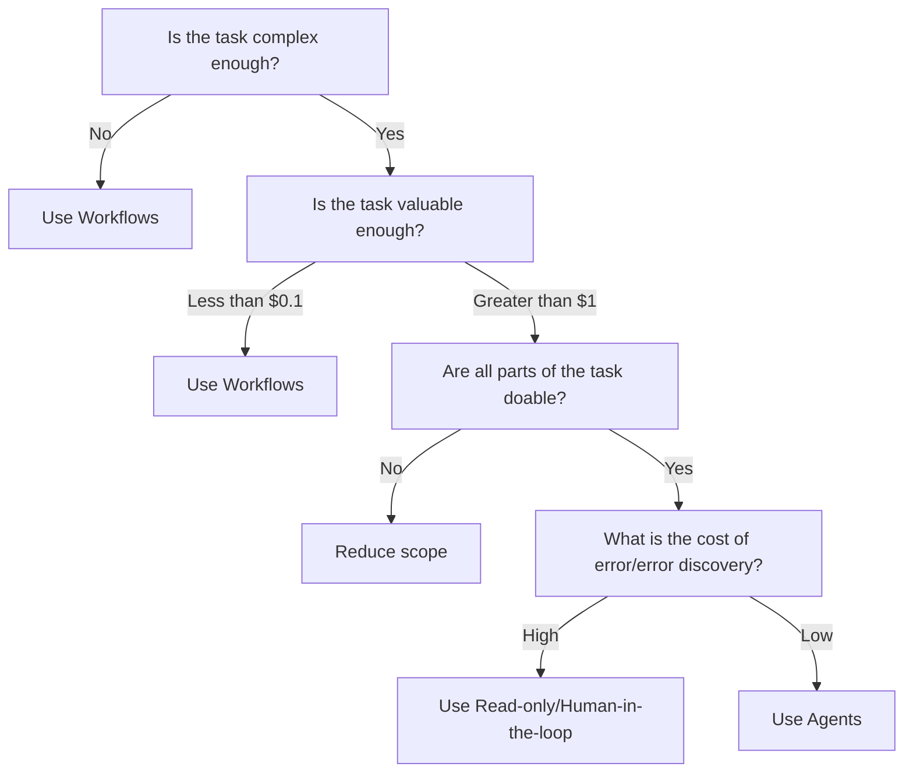

# Should i build an agent?

```mermaid
graph TD
    A[Is the task complex enough?] -->|No| B[Use Workflows]
    A -->|Yes| C[Is the task valuable enough?]

    C -->| Less than $0.1| D[Use Workflows]
    C -->| Greater than $1 | E[Are all parts of the task doable?]

    E -->|No| F[Reduce scope]
    E -->|Yes| G[What is the cost of error/error discovery?]

    G -->|High| H[Use Read-only/Human-in-the-loop]
    G -->|Low| I[Use Agents]

```

Sources: 
* https://www.anthropic.com/engineering/building-effective-agents