# Notes

## 10/06/2025
* Complete lab(s) or notebook(s) after the class has finished.
* Credits will last for full 3 week. Try to finish early instead of waiting for last session.

### What are AI Agents?
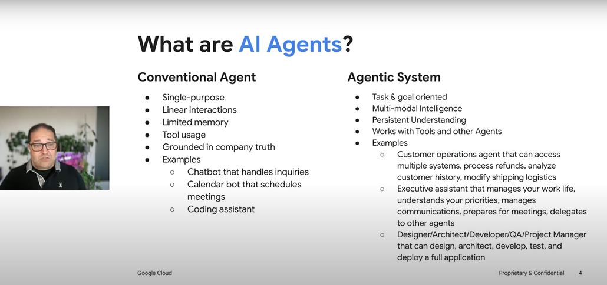

#### Conventional Agent
* Single Purpose
* Linear interactions
* Limited memory
* Tool usage
* Grounded in company truth
* Ex: Chatbot that handles inquiries, calendar bot that schedules meetings, Coding assistant

#### Agentic System
* Task & Goal Oriented
* Multi-modal intelligence
* Persistent Understanding
* Works with Tools and other agents
* The conventional agents mentioned earlier are just a subset of Agentic System here.

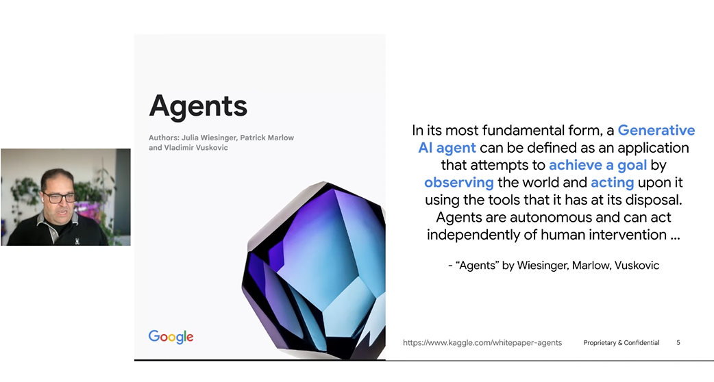

* Thoght space in AI studio comes from reinforcement learning

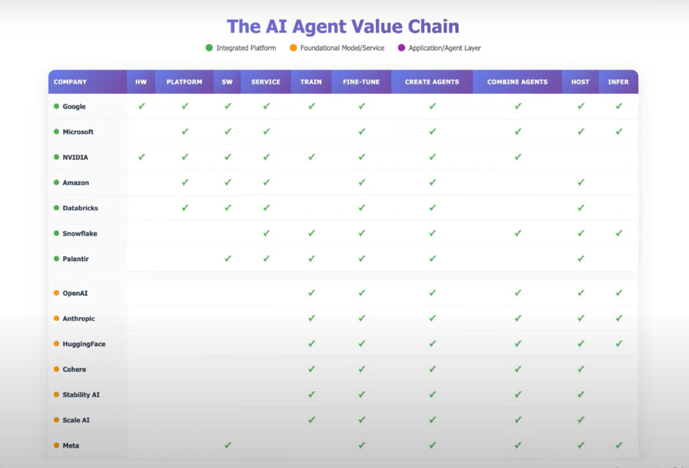

Agents take knowers and make it to doers. 
Knowers to doers - This is the value side in startup. This is the value layer. Agents that do things. Not just knowling things.

Do something - Thats how we make money. We make money by competing in doers space. Address the pain points.

Innovation at every layer of the stack happens at google.

### How do we make money? Where is the value?

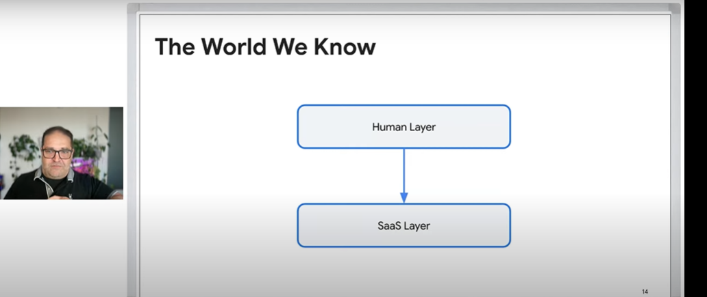
* SaaS Layer (first layer)
* Human Layer (second layer, where inefficiencies).It makes human layer more efficient. if we save 10% here, we save billions may be. It help people more be more efficient interacting with software. 

### AI Agents - Evolution

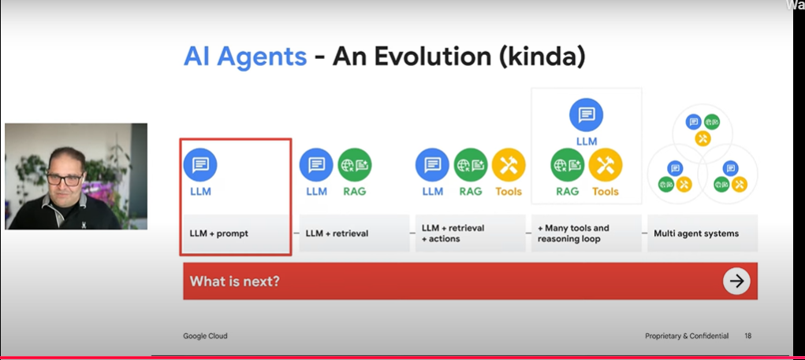

Model should be grounded in certain bit of truth.
Semantic compression = vectorization. We lose information. Accuracy / Recall trade off. Cosine similarly is cosine similarity. If we semantically compress, we will lost information. (vectorization).

But the magic happens in transformers (attention mechanism). wth these techniques (RAG, attention mechanism etc), we dont lose informatin in semantic compression.

### Innovation Confluence (The real evolution)

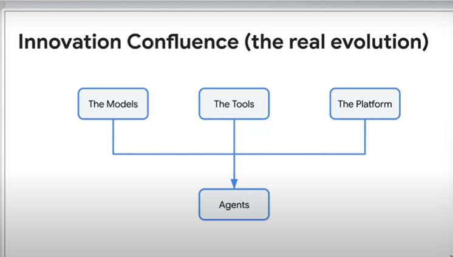

* When technogies come together, they open up doors for new use cases (Ex: Uber)

* The Models, The Tools, The Platform come together, then we got agents.

#### The Models 
* Radical drop in cost and latency, 
* Explosion in capability
* Massive context windows
* Multi modality

#### The Tools 
* Long term memory: Vector databases & big query
* Explosion in capability: Fucntion calling , reasoning & Planning
* Frameworks
* 

### The platform
* Hyperscale infra

### High level architecture

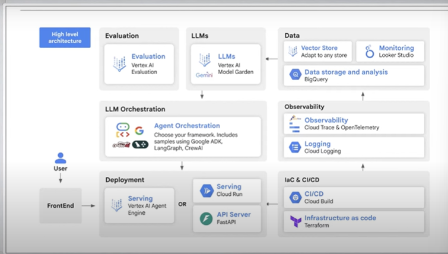

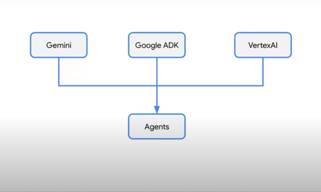

### Gemini

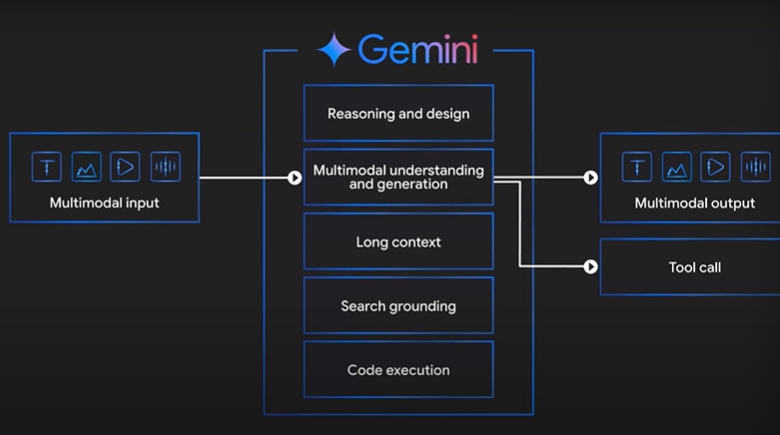
* It is natively multi modal

![alt text]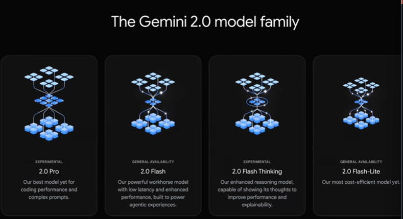

### ADK

Aim somewhere in middle the sweet spot. 

#### Axis of Agent Building

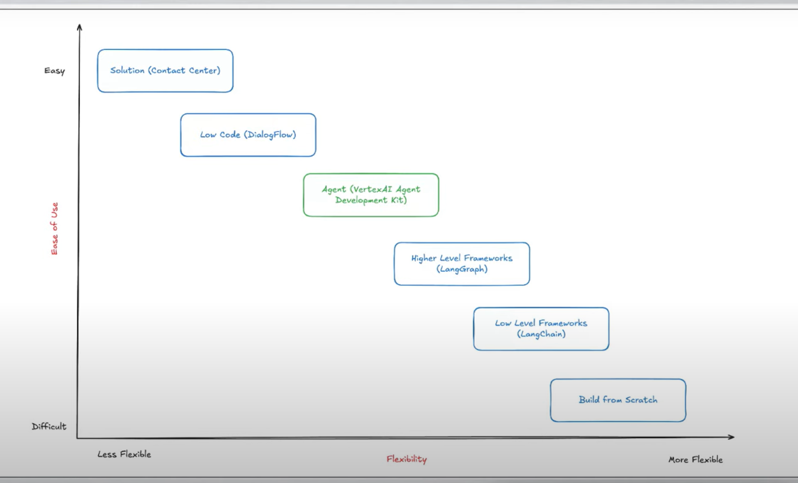

* LLM Orchestration

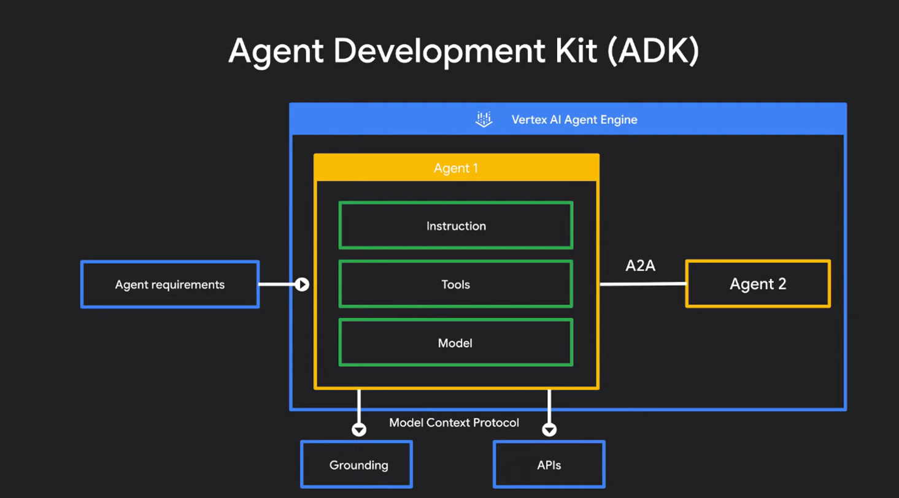

### Vertex AI
* With free tier, we share the data with google
* This is alternative to OpenAI
* It is PaaS. It is managed environment. 
* Can do the same with Iaas route with using GPU holding it for 24 hours, doing inference at our own side etc. But it is very expensive (the IaaS way).

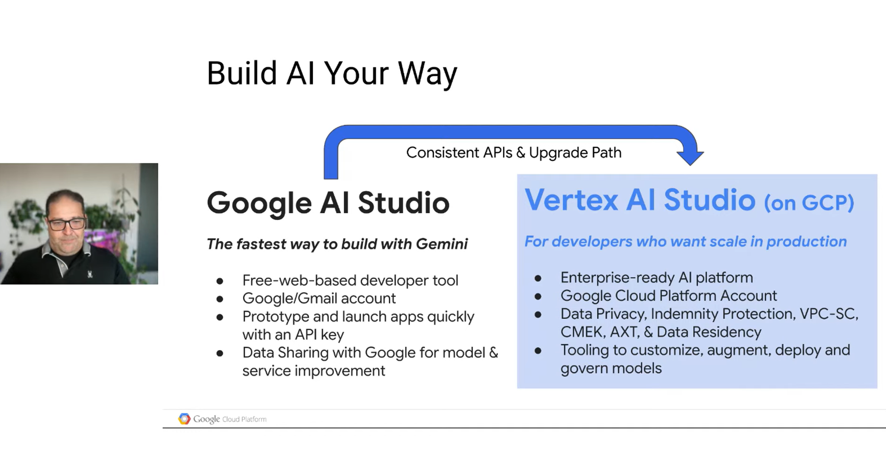

