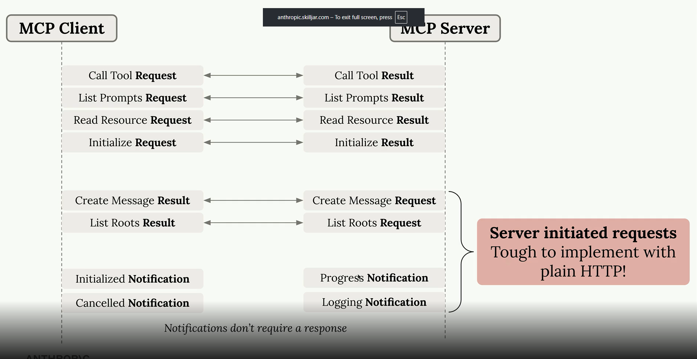

# Streamable HTTP Transport.

The streamable HTTP transport enables MCP clients to connect to remotely hosted servers over HTTP connections. Unlike the standard I/O transport that requires both client and server on the same machine, this transport opens up possibilities for public MCP servers that anyone can access.

However, there's an important caveat: some configuration settings can significantly limit your MCP server's functionality. If your application works perfectly with standard I/O transport locally but breaks when deployed with HTTP transport, this is likely the culprit.

## Configuration Settings That Matter

Two key settings control how the streamable HTTP transport behaves:
* stateless_http - Controls connection state management
* json_response - Controls response format handling

Revisiting the 4 type of communications in MCP which we saw in stdio,

## 4 type of communications
* Initial Request from Client to Server
* Response from Server to Client
* Initial Request from server to Client
* Response from Client to Server

In case of http communication, Http severs cannot easilty initiate communication with a client. Because clients don't have a known URL (The is due to the way http works). So in traditional http its very challenging for the server to request down to the client.

Hence in HTTP world some messsage types are tough to implement with normal HTTP.

* sampling requests
* listing roots
* progress notifications
* logging notifications

